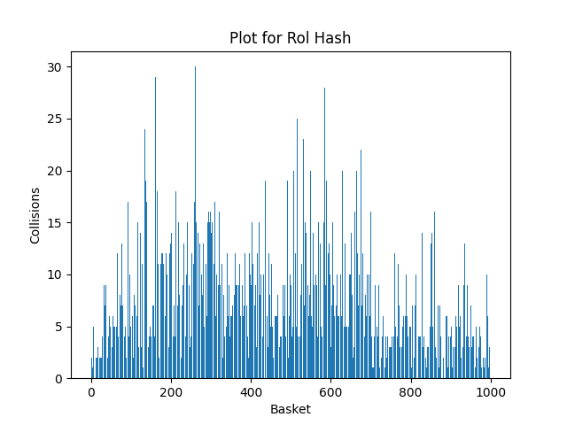
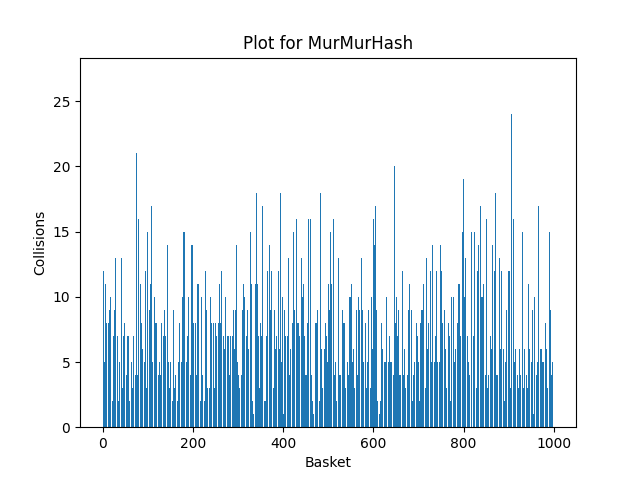

# HashTable
## Goals of this project

In this project i had two main goals:
1. Creating hashtable for fast word finding.
2. Optimizing algorithm using assembler, SIMD instructions and other methods.

## What is hashtable

Let's start by defining, what is hashtable actually.

For this we will need some definitions:
* **Key** - Any non-null object, in this project we will use strings as keys.
* **Hash Function** - function, that calculates value by given key.
* **Basket** - list in the hashtable.
* **Capacity** - number of buskets in the hashtable.
* **Collision** - case, where two different strings have the same key.
* **Load factor** - average size of buskets in the hashtable.

In this project **hashtable** is a table of linked lists and a hash functions attached to it. We will use text of Hamlet by William Shakespeare for filling the hashtable. For each word we will first count hash of it, then put it to corresponding basket.

We will test 7 different hash functions in the first part and the best one we will optimize in the second part.

# Chapter I: different hash functions

Let's take a take a look at different hash functions, for each one we will look at the amount of collisions in each list.

### Hash, that always returns 1

~~~C++
unsigned int HashReturn1(const char* input)
{
    return 1;
}
~~~
Here are the plot for this function: (Dispersion = 603397.56)

This is the ugliest thing i've seen in my life.

### Hash, that returns ASCII code of the first letter.
~~~C++
unsigned int HashReturnFirstASCII(const char* input)
{
    return input[0];
}
~~~
Here are the plot: (Dispersion = 19734.64)

This one looks not as ugly as a previous one, but it still is.
### Hash, that returns lenght of the word.
~~~C++
unsigned int HashReturnLen(const char* input)
{
    return strlen(input);
}
~~~

Plot for this one: (Dispersion = 77765.57)

Still not as good as we want.

### Hash, that returns sum of ASCII codes of the letters in the word.
~~~C++
unsigned int HashReturnSumASCII(const char* input)
{
    unsigned int sum = 0;

    for (int i = 0; input[i] != '\0'; i++)
    {
        sum += input[i];
    }

    return sum;
}
~~~

And here comes the plot: (Dispersion = 90.73)

This one looks decent, but we can make better.

### Hash, that uses $rol$ command from assembler.
~~~C++
unsigned int RolHash(const char* input)
{
    unsigned int hash = 0;

    for (int i = 0; input[i] != '\0'; i++)
    {
        hash = RolFunc(hash, 1) ^ input[i];
    }

    return hash;
}
~~~

ROL plot: (Dispersion = 50.88)

We are getting better and better, let's now take a look at similar function

### Hash, that uses $ror$ command from assembler.
~~~C++
unsigned int RorHash(const char* input)
{
    unsigned int hash = 0;

    for (int i = 0; input[i] != '\0'; i++)
    {
        hash = RorFunc(hash, 1) ^ input[i];
    }

    return hash;
}
~~~

ROR plot: (Dispersion = 49.22)

This one is even better than the previous one.

### CRC32 Hash

Famous CRC32 hash goes like this:

~~~C++
unsigned int CRCHashC(const char* input)
{
    unsigned int hash = 0;
    int len = strlen(input);
    unsigned int data = 0;
    int width = (8 * sizeof(unsigned int));

    for (int i = 0; i < len; i++)
    {
        data = input[i] ^ (hash >> (width - 8));
        hash = crcTable[data] ^ (hash << 8);
    }

    return hash;
}
~~~

And here's the plot fot it: (Dispersion = 18.34)

### MurMurHash

Here is the code for famous MurMurHash (我喜欢猫)
~~~C++
unsigned int MurMurHash(const char* data)
{
    int lenght = strlen(data);
    unsigned int seed = 0;
    const int shift = 24;
    const unsigned int base = 0x5bd1e995;

    unsigned int hash = seed ^ lenght;

    const unsigned char* buffer = (const unsigned char*) data;

    while (lenght >= 4)
    {
        unsigned int curr = *(unsigned int*) buffer;

        curr *= base;
        curr ^= curr >> shift;
        curr *= base;

        hash *= base;
        hash ^= curr;

        buffer += 4;
        lenght -= 4;
    }

    switch (lenght)
    {
        case 3:
            hash ^= buffer[2] << 16;
        case 2:
            hash ^= buffer[1] << 8;
        case 1:
            hash ^= buffer[0];
            hash *= base;
    };

    hash ^= hash >> 13;
    hash *= base;
    hash ^= hash >> 15;

    return hash;
}
~~~

Plot for this one looking good: (Dispersion = 17.99)

This one is the best so far. Let's stop at this variant and try to optimize what we have.

# Chapter II: Optimizations

## Experiment explanation

First of all, let's set out experiment conditions. As stated earlier, we will use text of Hamlet, written by William Shakespear to load the hashtable. Capacity of the hashtable will be 1000 baskets. Each word will be searched 10000 times. Using `callgrind` we will find hot spots of our programm. Programm will be compiled with `-O3` flag.

## Initial parameters

Before starting, let's take a look at a unoptimized programm.

Callgrind layout for it looks like this:

