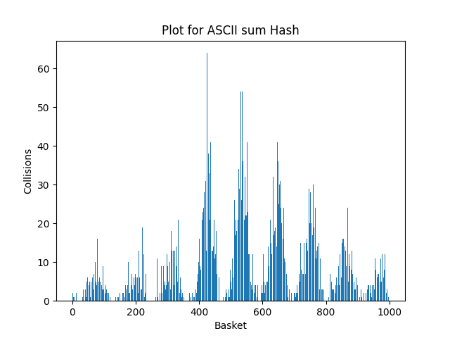

# HashTable
## Goals of this project

In this project i had two main goals:
1. Creating hashtable for fast word finding.
2. Optimizing searching algorithm using assembler, SIMD instructions and other methods.

## What is hashtable

Let's start by defining, what is hashtable actually.

For this we will need some extra definitions:
* **Key** - Any non-null object, in this project we will use strings as keys.
* **Hashvalue** - value for the corresponding key.
* **Hash Function** - function, that calculates hashvalue by given key.
* **Basket** - list in the hashtable.
* **Capacity** - number of baskets in the hashtable.
* **Collision** - case, where two different keys have the same hashvalue.
* **Load factor** - average size of baskets in the hashtable.

In this project **hashtable** is a table of linked lists and a hash function attached to it. This method of constructing hashtable is called **chaining method**.

Here's the example of hashtable, where hashfunction is a first letter of a word and keys are these words: "Emperor", "Horus", "Heresy", "Korvus". You can notice that the list with the letter A is empty, because no words, starting with the same letter was given. Same happens to all other letters, excluding E, H, K.

We will use text of Hamlet by William Shakespeare for filling the hashtable. For each word we will first count hashvalue of it, then put it to corresponding basket.

We will test 8 different hash functions in the first part and the best one we will optimize in the second part.

# Chapter I: different hash functions

Let's take a take a look at different hash functions, for each one we will look at the amount of collisions in each basket.

### Hash, that always returns 1

~~~C++
unsigned int HashReturn1(const char* input)
{
    return 1;
}
~~~
Here are the plot for this function:

>Dispersion = 603397.56, Load factor = 7807

This is the ugliest thing i've seen in my life.

### Hash, that returns ASCII code of the first letter.
~~~C++
unsigned int HashReturnFirstASCII(const char* input)
{
    return input[0];
}
~~~
Here are the plot:

>Dispersion = 19734.64, Load factor = 159

This one looks not as ugly as a previous one, but it still is.
### Hash, that returns lenght of the word.
~~~C++
unsigned int HashReturnLen(const char* input)
{
    return strlen(input);
}
~~~

Plot for this one:

>Dispersion = 77765.57, Load factor = 411

Still not as good as we want.

### Hash, that returns sum of ASCII codes of the letters in the word.
~~~C++
unsigned int HashReturnSumASCII(const char* input)
{
    unsigned int sum = 0;

    for (int i = 0; input[i] != '\0'; i++)
    {
        sum += input[i];
    }

    return sum;
}
~~~

And here comes the plot:

>Dispersion = 90.73, Load factor = 9.51

This one looks decent, but we can make better.

### Hash, that uses $rol$ command from assembler.
~~~C++
unsigned int RolHash(const char* input)
{
    unsigned int hash = 0;

    for (int i = 0; input[i] != '\0'; i++)
    {
        hash = RolFunc(hash, 1) ^ input[i];
    }

    return hash;
}
~~~

ROL plot:

>Dispersion = 50.88, Load factor = 8.28

We are getting better and better, let's now take a look at similar function

### Hash, that uses $ror$ command from assembler.
~~~C++
unsigned int RorHash(const char* input)
{
    unsigned int hash = 0;

    for (int i = 0; input[i] != '\0'; i++)
    {
        hash = RorFunc(hash, 1) ^ input[i];
    }

    return hash;
}
~~~

ROR plot:

>Dispersion = 205.93, Load factor = 21.15

This is the downgrade from the previous one.

### CRC32 Hash

Famous CRC32 hash goes like this:

~~~C++
unsigned int CRCHashC(const char* input)
{
    unsigned int hash = 0;
    int len = strlen(input);
    unsigned int data = 0;
    int width = (8 * sizeof(unsigned int));

    for (int i = 0; i < len; i++)
    {
        data = input[i] ^ (hash >> (width - 8));
        hash = crcTable[data] ^ (hash << 8);
    }

    return hash;
}
~~~

And here's the plot fot it:

>Dispersion = 18.34, Load factor = 7.81

### MurMurHash

Here is the code for famous MurMurHash (我喜欢猫)
~~~C++
unsigned int MurMurHash(const char* data)
{
    int lenght = strlen(data);
    unsigned int seed = 0;
    const int shift = 24;
    const unsigned int base = 0x5bd1e995;

    unsigned int hash = seed ^ lenght;

    const unsigned char* buffer = (const unsigned char*) data;

    while (lenght >= 4)
    {
        unsigned int curr = *(unsigned int*) buffer;

        curr *= base;
        curr ^= curr >> shift;
        curr *= base;

        hash *= base;
        hash ^= curr;

        buffer += 4;
        lenght -= 4;
    }

    switch (lenght)
    {
        case 3:
            hash ^= buffer[2] << 16;
        case 2:
            hash ^= buffer[1] << 8;
        case 1:
            hash ^= buffer[0];
            hash *= base;
    };

    hash ^= hash >> 13;
    hash *= base;
    hash ^= hash >> 15;

    return hash;
}
~~~

Plot for this one looking good:

>Dispersion = 17.99, Load factor = 7.81

## Analysis

In this part we will choose best function from previous ones. Obviously, ones to choose from is this ones: MurMurHash, CRC hash, Rotate left hash, ASCII sum hash. 
Let's put them all on one plot:

>Blue - Rotate left hash, Red - ASCII sum hash, Brown - MurMurHash, Green - CRC hash

Let's also compare dispersion and load factor of each function. Here is table for this:

| Hashfunction | Dispersion | Load factor |
| :----------: | :-------------------: | :------------------:       | 
| ASCII sum hash |  90.73            |       9.51           | 
| ROL hash |     50.88         |        8.28           | 
| CRC hash |     18.34         |        7.81           | 
| MurMur hash |    17.99          |      7.81             | 

From this data we can conclude: MurMurHash is the best. Let's choose it as a hashfunction for later use and move to chapter II.

# Chapter II: Optimizations

## Experiment explanation

First of all, let's set out experiment conditions. As stated earlier, we will use text of Hamlet, written by William Shakespear to load the hashtable. Capacity of the hashtable will be 1000 baskets. Each word will be searched 10000 times. Using `callgrind` we will find hot spots of our programm. Programm will be compiled with `-O3` flag.

## Base version

Before starting, let's take a look at a base variant of our programm.

 Callgrind layout for base version 

Let's put base variant into the table.

| Optimization | Number of machine commands | Absolute speed growth | Relative speed growth |
| :----------: | :-------------------: | :------------------:       | :---------------------:     |
| No optimization |   16 740 227 454           |   1                | 1                   |

## Optimization 1. Inline assembly of strcmp.

As we can see from callgrind layout for our base version, most hot spot is strcmp function. Let's try to optimize it by doing an inline assembly of our strcmp.

Code for it goes like this:

~~~C++
int inline strcmp_asm (const char* str1, const char* str2)
{
    int result = 0;
    asm(".intel_syntax noprefix\n\t"
        "mov rsi, %1\n\t"
        "mov rdi, %2\n\t"
        "Next:\n"
            "mov r11b, byte ptr [rsi]\n"
            "mov r10b, byte ptr [rdi]\n"
    	    "cmp r10b, 0\n"
    	    "je done\n"
    	    "cmp r11b, 0\n"
    	    "je done\n"
    	    "cmp r11b, r10b\n"
    	    "jne done\n"
    	    "inc rdi\n"
    	    "inc rsi\n"
    	    "jmp Next\n"
        "done:\n"
            "movzx rax, r10b\n"
            "movzx rbx, r11b\n"
    	    "sub rax, rbx\n"
        ".att_syntax"
        : "=r" (result) : "r" (str1), "r" (str2) : "rax", "rbx", "rsi", "rdi", "r10", "r11"
    );
    return result;
}
~~~

 Callgrind layout for optimization 1 

| Optimization | Number of machine commands | Absolute speed growth | Relative speed growth |
| :----------: | :-------------------: | :------------------:       | :---------------------:     |
| No optimization |   16 740 227 454           |   1                | 1                   |
| Optimization1 |   32 089 240 018           |   0.59                | 0.59                   |

We can notice significant drawback at programm speed, because of it we will not use this optimization later.

 Additional research for this optimization 

During my research, i was also doing some test with -O1 optimization flag.

In this variant, comparing to `-O3` variant i was able to get some speed up.

| Optimization | Speed growth  |
| :----------: | :-------------------: |
| No optimization (`-O1`) |    1           |
| Optimization1 |  1.1                   |

This shows, how different compilation flags can affect your programm.

## Optimization 2. Hash function in assembler.

Second hot spot in base variant was a MurMurHash function. Let's rewrite it on assembler. 

Code goes like this:

~~~Assembly
MurMurHashAsm:
        push rbx

        mov ebx, esi            ; seed ^ lenght
        xor eax, eax

.Next:  imul eax, dword [rdi], BASE     ; curr *= base
        mov ecx, eax
        shr ecx, 24             ; curr >> shift

        xor eax, ecx            ; curr ^= curr >> shift

        imul ebx, ebx, BASE     ; hash *= base
        xor ebx, eax            ; hash ^= curr
        add rdi, 4              ; buffer += 4
        sub rsi, 4              ; lenght -= 4

        cmp rsi, 4              ; while (lenght >= 4)
        jge .Next

        mov eax, ebx            ; hash in rax
        xor ebx, ebx

        cmp rsi, 3
        je .Three
        cmp  rsi, 2
        je .Two

        jmp .Done

.Three: movzx ebx, byte [rdi + 2]  ; buffer[2]
        sal ebx, 16             ; buffer[2] << 16
        xor eax, ebx            ; hash ^= buffer[2] << 16

.Two:   movzx ebx, byte [rdi + 1]  ; buffer[1]
        sal ebx, 8              ; buffer[1] << 8
        xor eax, ebx            ; hash ^= buffer[1] << 8

.Done:  movzx ebx, byte [rdi]      ; buffer[0]
        xor eax, ebx            ; hash ^= buffer[0]
        imul eax, eax, BASE     ; hash *= r12

        mov ebx, eax            ; hash in rbx
        shr ebx, 13             ; hash >> 13
        xor eax, ebx            ; hash ^= hash >> 13

        imul eax, eax, BASE     ; hash *= base
        mov ebx, eax            ; hash in rbx
        shr ebx, 15             ; hash >> 15
        xor eax, ebx            ; hash ^= hash >> 15

        pop rbx
        ret

.data

BASE equ 0x5bd1e995
~~~

 Callgrind layout for optimization 2 

Also, let's calculate assembler efficiency coefficient. Check out this [work](https://github.com/TNVC/HashTable), it was first mentioned here.

Coefficient calculated as stated: $D = \frac{A}{L} \cdot 1000 $, where A is an acceleration and L is a number of lines in assembler.

In our case: D = 16.2

| Optimization | Number of machine commands | Absolute speed growth | Relative speed growth |
| :----------: | :-------------------: | :------------------:       | :---------------------:     |
| No optimization |   16 740 227 454           |   1                | 1                   |
| Optimization1 |   32 089 240 018           |   0.52                | 0.52                   |
| Optimization2 |   16 260 100 266           |   1.05                | 1.76                   |

Finally, we were able te get some speed growth. This optimization remains in place.

## Optimization 3. Implementing SIMD instructions.

In this optimization we will use SIMD instructions, you can read about them [here](https://github.com/aleksplast/SIMD)

Let's take a closer look at given text. Maximal word lenght in it is 13 symbols. Let's edit given file, adding each word up to 16 symbols. Now we can change our key format to __m128i. With it we can change strcmp function to intrinsic analogue.

New function looks like this:

~~~C++
SearchStatus FindByHash(HashTable* hashtable, __m128i input)
{
    unsigned int hash = hashtable->function(input) % hashtable->size;

    Node* curelem = hashtable->table[hash]->fictelem->prev;
    Node* fictelement = hashtable->table[hash]->fictelem;

    while (curelem != fictelement)
    {
       if (_mm_testnzc_si128(curelem->val, input) == 0)
           return SEARCH_SUCCESS;
        curelem = curelem->prev;
    }

    return SEARCH_FAILURE;
}
~~~

 Callgrind layout for optimization 3 

| Optimization | Number of machine commands | Absolute speed growth | Relative speed growth |
| :----------: | :-------------------: | :------------------:       | :---------------------:     |
| No optimization |   16 740 227 454           |   1                | 1                   |
| Optimization1 |   32 089 240 018           |   0.52                | 0.52                   |
| Optimization2 |   16 260 100 266           |   1.05                | 1.76                   |
| Optimization3 |   9 441 826 101           |   1.74                | 1.67                   |

## Optimization 4. Changing hash function.

In this part, we will try to change our hash function. Let's consider CRC function as an opponent to MurMurHash. CRC is faster, but has roughly the same load factor. Also, it has an in-built instrinsic function for faster calculation. We are lucky, because in previous step we changed all keys to __m128i format.

Now, our hash function looks like this:

~~~C++
unsigned int CRCHash(__m128i input)
{
    unsigned int hash = 0;
    unsigned char* str = (unsigned char*)(&input);

    for (int i = 0; i < 16; i++)
    {
        hash = _mm_crc32_u32(hash, str[i]);
    }

    return hash;
}
~~~

 Callgrind layout for optimization 4 

| Optimization | Number of machine commands | Absolute speed growth | Relative speed growth |
| :----------: | :-------------------: | :------------------:       | :---------------------:     |
| No optimization |   16 740 227 454           |   1                | 1                   |
| Optimization1 |   32 089 240 018           |   0.59                | 0.59                   |
| Optimization2 |   16 260 100 266           |   1.05                | 1.76                   |
| Optimization3 |   9 441 826 101           |   1.74                | 1.67                   |
| Optimization4 |   6 711 633 355           |   1.80                | 1.03                   |

## Optimization 5. Reducing load factor.

In this part we will reduce load factor. It is the most obvious way to optimize hash function. Maybe you were asking yourself: "Why didn't we do it in the first place?". 
Of course, we will increase our programm speed, but this comes at cost too. We will need more memory for this hashtable. Also, with low load factor we will find words almost instantly, thus there will be nothing left to optimize. This optimization is the last one in educational purposes. 

Let's change capacity of our hashtable to 8000, load factor will be around 2.

 Callgrind layout for optimization 5 

| Optimization | Number of machine commands | Absolute speed growth | Relative speed growth |
| :----------: | :-------------------: | :------------------:       | :---------------------:     |
| No optimization |   16 740 227 454           |   1                | 1                   |
| Optimization1 |   32 089 240 018           |   0.59                | 0.59                   |
| Optimization2 |   16 260 100 266           |   1.05                | 1.76                   |
| Optimization3 |   9 441 826 101           |   1.05                | 1.67                   |
| Optimization4 |   6 711 633 355           |   1.80                | 1.03                   |
| Optimization5 |   5 504 922 705           |   4.59                | 2.55                   |

# Conclusion

* In this project we learned, what is hashtable, how to construct it
* We tested 8 different hash functions and chose the best one
* Using assembler, SIMD instructions and other methods we were able to make search in hashtable 4.59 times faster than compiler could

Here is final table with all optimizations.

| Optimization | Number of machine commands | Absolute speed growth | Relative speed growth |
| :----------: | :-------------------: | :------------------:       | :---------------------:     |
| No optimization |   16 740 227 454           |   1                | 1                   |
| Optimization1 |   32 089 240 018           |   0.59                | 0.59                   |
| Optimization2 |   16 260 100 266           |   1.05                | 1.76                   |
| Optimization3 |   9 441 826 101           |   1.05                | 1.67                   |
| Optimization4 |   6 711 633 355           |   1.80                | 1.03                   |
| Optimization5 |   5 504 922 705           |   4.59                | 2.55                   |

# References:

1. https://github.com/aleksplast/SIMD
2. https://github.com/TNVC/HashTable
